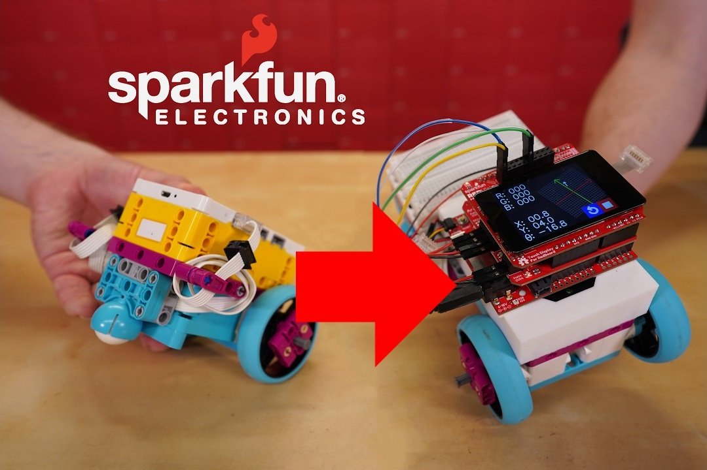

# RedBoard Robot, Compatible with LEGOⓇ

LEGO devices which use the Powered Up connector are actually quite easy to hack into! To demonstrate this, we built a robot using hardware from the LEGO SPIKE platform and various off-the-shelf hobby electronics, MicroPython, and 3D printing!

This also demonstrates that you can dramatically expand the capabilities of your LEGO robot. Add sensors and displays, create your own breadboard circuits, or 3D print your own mechanisms!

## Getting Started

This is not a full guide or tutorial, and support is not being offered at this time. But the project is documented here for anyone who wants to learn about it, and for more savvy users that want to try it themselves. Take a look at [this page](getting_started.md) to learn more!

## Technical Info

For anyone wanting to know more technical details, such as the Lego connectors and message protocol, take a look at [this page](technical_info.md) to learn more!

## Disclaimer

This project in its entirety is the work of SparkFun Electronics, and is in no way affiliated with any third parties.
