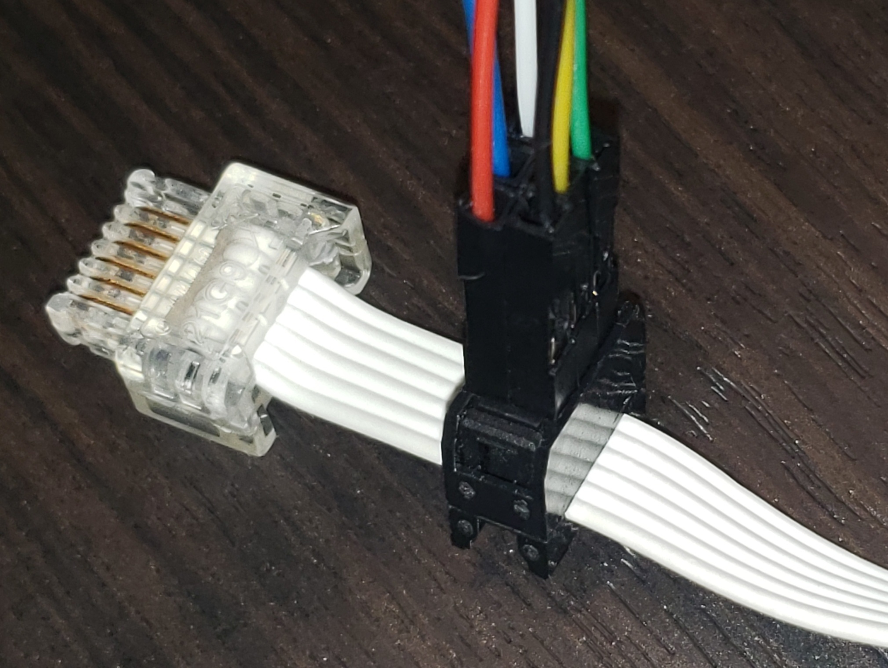

# Technical Info

## Powered Up Connector

### Hardware

The most recent connector used by various LEGO robot platforms is the Powered Up connector. This seems to go by other names like LEGO Power Functions 2.0 (LPF2) and WeDo 2.0, but they're all the same. It is different from the Power Functions connector, and the RJ12 jack used on EV3 and NXT devices (all of them are proprietary connectors). We're just focusing on the Powered Up connector for now.

This connector has been reverse engineered by various community members. [This page lists physical and electrical specs](https://www.philohome.com/wedo2reverse/connect.htm). It's a 6-pin connector that has 2 pins for motor power (or battery power for other devices if needed), 2 pins for logic power, and 2 pins for a UART interface. The pinout is:

1. Motor power pin 1
2. Motor power pin 2
3. GND
4. 3.3V
5. UART (hub -> device)
6. UART (device -> hub)

Because the connector is proprietary, it's not really usable with off-the-shelf parts. However, the cable is just a standard 1.27mm pitch flat ribbon cable, so it's actually really easy to bypass the connector entirely! There is a kind of connector called an insulation displacement connector (IDC), which come in 2 parts that you press onto a ribbon cable ([here's an example](https://www.sparkfun.com/ribbon-crimp-connector-6-pin-2x3-female.html)). One part has metal blades that pierce through the insulation (displaces the insulation?) and make electrical contact with the wire inside. No special tools are needed, no stripping wires, no soldering or crimping tiny pins. Just squish the 2 parts together, that's it!

You do need to be a bit careful though. The second part of the connector can break if it's not pressed straight on. There are dedicated crimping tools you can get for these, but a strong flat object is totally sufficient for this. Also be sure to align the pin 1 indicator with pin 1 of the cable!

Once the connector is attached, you can just insert standard 0.1" jumper wires into the connector to connect with other electronics.

## UART Protocol

Although a standard UART interface is used, LEGO devices use a special message protocol for getting device info, sensor data, and controlling the devices. This is often referred to as the LEGO UART Message Protocol (LUMP), and is documented quite clearly on [this page](https://github.com/pybricks/technical-info/blob/master/uart-protocol.md). It's super helpful, it's full of details about the contents of each message, and other parameters like header info and checksum calculation.

Every LEGO device builds on this, so this project creates a base [`LumpDevice`](code/lib/lego_devices/lump_device.py) class that all other devices inherit from.
